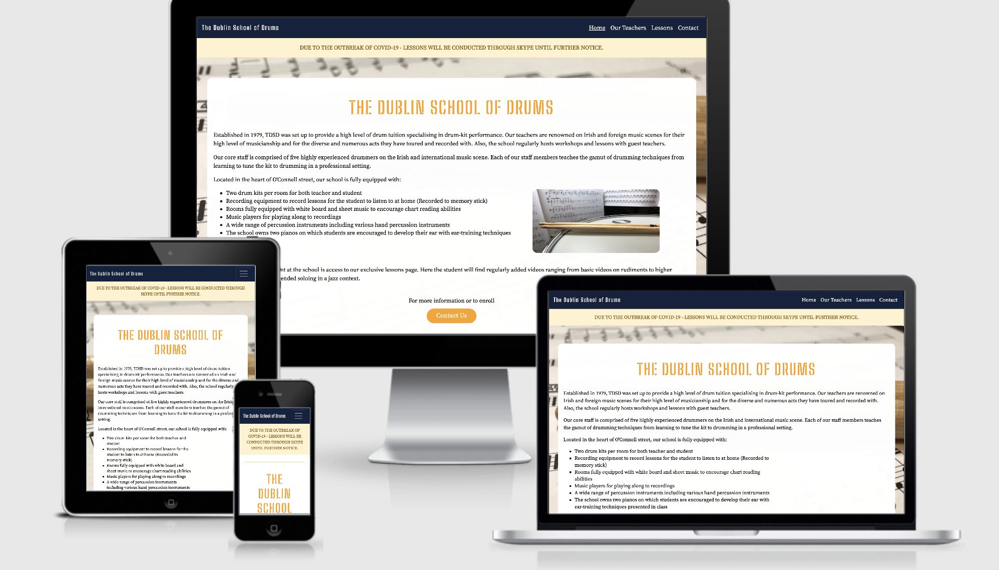
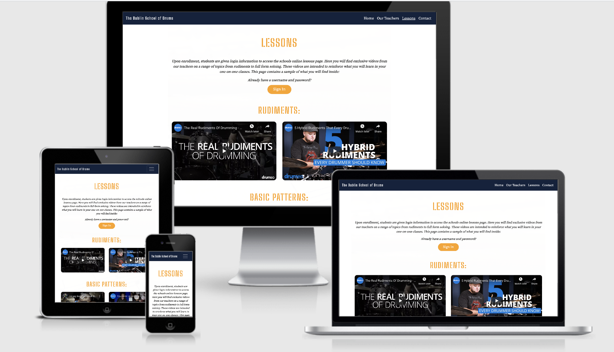

# The Dublin School of Drums (MS1 Project - Code Institute - Aaron Harbourne)
This is a website to promote an imaginary business called The Dublin School of Drums which provides in-person drum lessons to students at a location in Dublin city centre. It is intended to provide all relevant information to potential clients including 
the schools history, list of facilities, teachers list, student feedback and all contact information. Included in this project is a page called Lessons. This is a 
page with four instructional videos divided into two categories. The idea of this is to provide a sample to potential clients of a 
larger, regularly updated page that they would be given access to upon enrolment. The lessons page presented in this project is therefore a 
smaller sample page with four videos and two categories that would be expanded upon in both number of videos and categories in a larger
page requiring a sign in name and password. (Only the sample page is presented in this project).
 

Above images demonstrate sites responsiveness across screen and device sizes

## User Experience
The wireframes created as a reference for the look and features of the site are viewable [here](dublin-school-of-drums-wireframes.pdf).

User Stories:

1. First Time Visitor Goals:
* As a first time visitor I want to find all relevant information on the school. This includes facilities, location, teachers biographies,
lesson content and contact information (i.e email, phone number and social media links).
* As a first time visitor I want to read positive feedback from past pupils and read about how attending the school has benefitted
their playing. 
* As a first time visitor I want a way to contact the school to either get more information or to be sent enrolment forms.
* As a first time visitor I am interested in any features of the website that are unique to the school such as in this case, the lessons page
which is exclusive to enrolled students (Sample of this page presented in this project).
* As a first time visitor I am interested to hear and see the teachers playing music to assess whether I want to study with them.

2. Returning Visitor Goals:
* As a returning visitor I want to access exclusive content on the site provided to me upon enrolment, in this case it is exclusive content
on the lessons page which is exclusive to enrolled students.
* As a returning visitor I want continued access to past recordings of the teachers, presented here in the clickable profile pictures in the teachers.html
page and linking to youtube videos of them playing.
* As a returning visitor I want continued access to social media to view updates at the school.
* As a returning visitor I want to be reminded of the location of the school, presented here in an embedded google map with the written
address beside it. 

3. Regular visitor goals:
* As a regular visitor I want to access exclusive content on the site provided to me upon enrolment, in this case it is exclusive content
on the lessons page which is exclusive to enrolled students.
* As a regular visitor to the site I want to know of any major events or disruptions to normal school activity. In this case the alert
on the index.html page tells students that lessons will be presented on Skype due to Covid-19. 

## Design
* Font Type:
1. 'Big Shoulders Stencil Text', from Google Fonts was used for the logo and headings throughout the site. This was chosen as it reminded me of the 
typeface for the Irish music store and school [Xmusic](https://www.xmusic.ie/). I feel that the 'Big Shoulders Stencil Text' font type will appeal more to a user
interested in music which is generally a less formal activity than studying at a university for example, the website for which would require a more formal font type.
The secondary font chosen is sans-serif, which most web browsers will display if they don't support the chosen font.
2. The font type for the rest of the site is 'Source serif pro' from Google Fonts with a fallback font of sans-serif. This was chosen for its
easy readability.
* Colour Scheme: 
1. The colors of black, blue, orange, platinum, and white were chosen as they contrast well with each other. They are also bright
which I feel may contribute to a better user experience on the site.
2. All five teachers images are in black and white and when hovered over reveal a colour image of that teacher adding to the colour of 
the site.
* Pictures are added throughout the site to add colour, add a visual change to long text, and provide visual information as to what the staff of the school look like.

## Testing

* The Contact Us button on the index.html page brings the user straight to the Contact page bypassing the rest of the site. This page opens up
in the same tab as the Contact page is on the same website. This is for potential clients who are interested by the schools description to enrol or ask for more information without viewing the teachers list or lessons page.
* The Carousel slide on the index.html page moves to the next image and comment automatically. It also has arrows that the user can click
to see the next image/comment to the left or right faster.
* The email address when clicked opens the users email site in a new tab.
* The social media links when clicked, open up in a new tab so user does not forget the site they left.
* On teachers.html each of the five images when clicked links to a youtube video in a new tab.
* Each of the images on teachers.html when hovered on displays a new image of that teacher so that the potential client can see them 
performing.
* on lessons.html, the Sign In button opens up a modal which effectively keeps the users attention by darkening the rest of the page.
* This modal allows the user to sign in for exclusive content. If the user fails to insert an @ into the email address and presses the Sign In
button, an alert will inform them that they must use the @ symbol in order to be able to sign in and will not allow the sign in until this
symbol is included.
* Each of the four videos on the lessons.html page will play when the user clicks on them and pause when clicked on again. Also all
four videos can be watched from whatever part the user wishes by dragging the dot on the red band to the desired time location.
* On the contact.html page the Submit button will only submit the form if the email address has the @ symbol in it.
* The embedded Google map on the contact.html page can be zoomed in and out of as the user may need by using the plus and minus symbols on the lower righthand corner. Also a street view can be accessed
by clicking on the square in the lower left corner for the user to see the building as it looks in reality. If the user wishes
they can click on the link title 'see larger map' which will open up a larger view of the map in a new tab if they find the map presented
on the Contact page unreadable.
* The website [Responsivedesign.is](https://www.responsivedesign.is) was used as well as the inspect tool in Google Chrome
throughout the development to ensure the sites responsiveness across device sizes. 
* The code syntax was tested for errors using the W3C Mark Up Validator and W3C CSS Validator. This was to ensure that the code was
valid and worked properly. [Link to W3C Mark up Validator](https://www.validator.w3.org/), [Link to Css validator](http://www.jigsaw.w3.org/css-validator/)
* The code itself was indented for easier future adjustments using this [Web Formatter](https://www.webformatter.com/css)

## Features

1. The site is responsive accross different device sizes. 
2. The site includes numerous buttons. One is located on the landing page and is intended to bring the user to the Contact page. Another
is located on the Lessons page which opens a modal allowing the user to sign in or close the modal. A third button is located on the 
Contact page allowing the user to submit a form.  
3. The site includes a Navigation bar giving users access to the four pages of the site from any page.
4. The mobile view of the navigation bar features a drop down menu instead of four links appearing side by side. The four links then appear
when the dropdown menu is clicked underneath the navigation bar.
5. The site includes a footer with clickable social media links bringing users to social media pages in a new tab.
6. In the footer also is an email link which is intended to open up a blank email composition for the user to contact the school.
7. The four links in the navigation bar, the social media and email links in the footer and the buttons all have hover effects applied to them.
This lets the user intuitively know that these features when clicked will perform an action. 
8. The images in the teachers page when clicked change to another image of that teacher adding to the sites colour.

### Features left to implement
1. The lessons page when signed into, will have more videos and categories for these videos to be organised into. Also videos
would be added regularly. Only the sample page is included in this project therefore this would still have to be implemented.

## Problems encountered during development
1. On the Galaxy Fold screen during responsive development, the drop down menu came below the schools logo due to it being too big
on that screen size. Therefore it had to be made smaller using CSS to have it appear to the right of the logo. 
2. On the mobile view of the index page, the background image was too domineering when trying to read the text, so I put in a white background
on mobile view instead of the image making the text easier to read.
3. On mobile view the footer looked too cluttered so I used a bootstrap grid to put the sections on top of each other rather than side by side.

## Technologies used
* HTML - This was used to form the basic undecorated structure of the site. Implemented using html was all text, images, and basic structural layout.
* CSS - Css was used to decorate the site. This includes putting headers in the middle of the page, colouring backgrounds on the Carousel and footer
, adding font sizes to the text and decorating the images with the border-radius style as just some examples.
* JavaScript - The modal used on the lessons page and taken from bootstrap ver. 4.3 uses Javasript. 
*  Bootstrap - Bootstrap vesion 4.3 was used in this site. This is a library to get ready made code that can be copy and pasted into ones own project.
The code was then styled using my own CSS styling. The page is available here [Link to Bootstrap version 4.3](https://www.getbootstrap.com/docs/4.3/getting-started/download/)
*  Google Fonts - This site was used to get the two font styles used in this project. [Link to Google Fonts](https://www.fonts.google.com/)
* Font Awesome - This website provided the social media icons in the footer of my page. [Link to Font Awesome](https://www.fontawesome.com/)
* Balsamiq - This site was used to create the wireframes from which I structured the look of the finished site. [Link to Balsamiq](https://www.balsamiq.com/)
* Github - This site was used as a repository for updates to the progress of the site. [Link to Github pages](https://www.github.com/)
* Git - This was used to record progress on the site via commits. These commits were then pushed to Github for a more concrete repository of the work.
* Gitpod - This is the editor used to code with. [Link to Gitpod](https://www.gitpod.io/)

## Deployment
Both Git and Github were used to record the process of the sites development. Using the command terminal on Gitpod, progress was saved to Git
via commits. The process was done by typing git add, plus the filename to save a single file or . to include all files. Then git commit -m and
a commit description included in double quotes such as these "" was used to describe the commit for future reference. 

Following the git commit, files were pushed to Github using the git push command in the terminal. Github then stored the project in a more
reliable way as git deletes commands after a certain length of time whereas Github does not.

The site was then hosted on Github pages via the settings option on Github.

## Credits
### Photos:

Index Page:
1. Sticks on snare drum photo visible only in mobile view taken from stooshe.com (https://www.stooshe.com/how-to-choose-drumsticks)
2. Photo of 'Hal Staunton' taken from the Dhaka Tribune (https://www.dhakatribune.com/showtime/2019/03/13/legendary-drummer-hal-blaine-dies-at-90)  
3. Photo of 'Michael Murtagh' taken from Modern Drummer (https://www.moderndrummer.com/article/january-2018-foo-fighters-taylor-hawkins/)
4. Photo of 'Ciara O'Brien' taken from The Music Learning Centre (https://www.themusicianslearningcenter.com/drum-lessons-in-raleigh-nc/)
5. Photo of 'Philip Connolly' taken from cruiseshipdrummer.com (http://www.cruiseshipdrummer.com/2017/02/han-bennink-practice-tips.html)
6. All other photos on Index page are my own. 

Teachers Page:
1. Matt Cameron black and white photo from his Wikipedia Page (https://en.wikipedia.org/wiki/Matt_Cameron)
2. Colour photo of Matt Cameron taken from his Drummerworld page (https://www.drummerworld.com/drummers/Matt_Cameron.html) 
3. Danny Carey black and white photo taken from his listing on the D'Addario site (https://www.daddario.com/artists/evans-drumheads/danny_carey/)
4. Colour photo of Danny Carey taken from music news site Stereogum (https://www.stereogum.com/1974724/danny-carey-on-tools-new-album-itll-be-out-in-2018/news/)
5. Samantha Maloney black and white photo from Celeb Net Worth (https://celebnetworth.net/samantha-maloney-bio-wiki-net-worth-age-height-weight/) 
6. Colour photo of Samantha Maloney taken from Pinterest (https://www.pinterest.com/wearamradio/females-hitting-drums/)
7. Jimmy Chamberlain black and white photo taken from Pinterest (https://br.pinterest.com/pin/252131279112390545/) 
8. Colour photo of Jimmy Chamberlain taken from YouTube thumbnail found on Google images (https://www.youtube.com/watch?v=61VGr1-VXAg) 
9. Tony Williams black and white photo from Getty Images (https://www.gettyimages.ie/detail/news-photo/tony-williams-performing-with-vsop-at-the-greek-theater-in-news-photo/98304324)
10. Colour photo of Tony Williams taken from SFJAZZ (https://www.sfjazz.org/onthecorner/tony-williams-5-songs)

### Videos
Lessons Page:
1. Three videos are taken from the Drumeo Youtube channel (https://www.youtube.com/user/freedrumlessons)
2. The other video is taken from the Drum Beats Online Youtube channel (https://www.youtube.com/user/DrumBeatsOnline)
